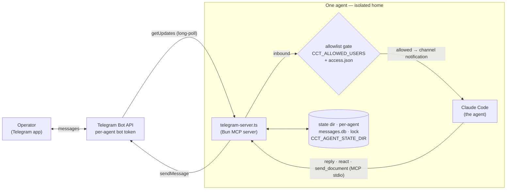

<!-- ---
!-- Timestamp: 2026-04-10 18:13:14
!-- Author: ywatanabe
!-- File: /home/ywatanabe/proj/claude-code-telegrammer/README.md
!-- --- -->

<!-- SciTeX Convention: Header (logo, tagline, badges) -->
# claude-code-telegrammer

<p align="center">
  <a href="https://scitex.ai">
    
  </a>
</p>

<p align="center"><b>Custom Telegram MCP server + TUI auto-responder for running Claude Code as an autonomous Telegram agent</b></p>

<p align="center">
  <a href="https://badge.fury.io/py/claude-code-telegrammer"></a>
  <a href="https://claude-code-telegrammer.readthedocs.io/"></a>
  <a href="https://github.com/ywatanabe1989/claude-code-telegrammer/actions/workflows/test.yml"></a>
  <a href="https://www.gnu.org/licenses/agpl-3.0"></a>
</p>

<p align="center">
  <a href="https://claude-code-telegrammer.readthedocs.io/">Documentation</a> ·
  <code>pip install claude-code-telegrammer</code>
</p>

---

**What it is:** a self-contained Telegram bridge for Claude Code — a Bun MCP
server that turns any Claude Code session into an autonomous agent you talk to
over Telegram, plus a TUI watchdog that keeps it running unattended. Each agent
runs its own bot, its own message store, and fails loud on misconfiguration.

## Problem and Solution

<table>
<tr>
  <th align="center">#</th>
  <th>Problem</th>
  <th>Solution</th>
</tr>
<tr valign="top">
  <td align="center">1</td>
  <td><h4>Hardcoded paths</h4>The official plugin hardcodes <code>~/.claude/</code> as its state directory (<a href="https://github.com/anthropics/claude-code/issues/851">#851</a>), making it impossible to run multiple bots or customize where access.json lives.</td>
  <td><h4>Configurable state directory</h4>All state (DB, lock, access config) lives under <code>CLAUDE_CODE_TELEGRAMMER_AGENT_STATE_DIR</code>. Run as many bots as you want, each with its own isolated state.</td>
</tr>
<tr valign="top">
  <td align="center">2</td>
  <td><h4>409 Conflict crashes</h4>No single-instance guard — multiple sessions polling the same bot get 409 errors and crash each other (<a href="https://github.com/anthropics/claude-code/issues/1075">#1075</a>).</td>
  <td><h4>PID-based lock</h4>Automatic single-instance enforcement via PID lock file. Second instance detects the conflict and waits instead of crashing.</td>
</tr>
<tr valign="top">
  <td align="center">3</td>
  <td><h4>Zombie CPU consumption</h4>After session ends, the plugin process lingers at 100% CPU — requires manual kill (<a href="https://github.com/anthropics/claude-code/issues/1146">#1146</a>).</td>
  <td><h4>Clean shutdown</h4>Exits gracefully on stdin close, SIGTERM, or SIGINT. No zombies, no manual cleanup.</td>
</tr>
<tr valign="top">
  <td align="center">4</td>
  <td><h4>Only 3 basic tools</h4>The official plugin provides just send, get_updates, and set_reaction — no history, no search, no file handling, no message editing.</td>
  <td><h4>10 MCP tools</h4>reply, react, edit_message, get_history, get_unread, mark_read, download_attachment, send_document, search_messages, get_context — everything an autonomous agent needs.</td>
</tr>
<tr valign="top">
  <td align="center">5</td>
  <td><h4>No message persistence</h4>Messages vanish after delivery. No way to search past conversations, track read status, or build context from history.</td>
  <td><h4>SQLite message store</h4>All messages persisted in WAL-mode SQLite with full-text search, reply threading (reply_to_message_id), read/replied tracking, and attachment metadata.</td>
</tr>
<tr valign="top">
  <td align="center">6</td>
  <td><h4>No access control for groups</h4>Basic allowlist only — no per-group policies, no hot-reload when config changes.</td>
  <td><h4>DM + group policies</h4>Allowlist-based access control with separate DM and group chat policies via <code>access.json</code>, hot-reloaded on file change (mtime-based).</td>
</tr>
<tr valign="top">
  <td align="center">7</td>
  <td><h4>No attachment support</h4>Cannot download inbound files or upload documents to chats.</td>
  <td><h4>Full attachment handling</h4>Inbound photos, documents, voice, audio, and video are auto-downloaded. Upload local files via <code>send_document</code> tool.</td>
</tr>
<tr valign="top">
  <td align="center">8</td>
  <td><h4>Sessions stall unattended</h4>Claude Code halts at permission prompts or idle states with no way to recover — the agent just stops working.</td>
  <td><h4>TUI Watchdog</h4>Polls GNU Screen buffer, detects TUI state via pattern matching, sends keystrokes to auto-accept prompts and re-engage on idle. Throttled with burst limits.</td>
</tr>
</table>

<p align="center"><sub><b>Table 1.</b> Eight issues with the official Telegram plugin (as of April 2026) and how claude-code-telegrammer addresses each.</sub></p>

## Quickstart

**Prerequisites:** [Bun](https://bun.sh/) ≥ 1.0 (MCP server); GNU Screen (watchdog, optional).

```bash
git clone https://github.com/ywatanabe1989/claude-code-telegrammer.git
cd claude-code-telegrammer/ts && bun install
```

**1. Get a bot token** — message [@BotFather](https://t.me/BotFather), send
`/newbot`, and copy the token (`123456789:AAH...`). Open your bot and send it any
message. Verify: `curl -s "https://api.telegram.org/bot<TOKEN>/getMe"`.

**2. Register the MCP server** with Claude Code — copy `.mcp.json.example` to
`.mcp.json` (gitignored) and set `CLAUDE_CODE_TELEGRAMMER_BOT_TOKEN` +
`CLAUDE_CODE_TELEGRAMMER_ALLOWED_USERS` (your Telegram user id, from
[@userinfobot](https://t.me/userinfobot)). Full env reference:
[docs/configuration.md](docs/configuration.md).

**3. Run:**

```bash
claude --dangerously-skip-permissions \
       --dangerously-load-development-channels server:claude-code-telegrammer
```

You should see `Listening for channel messages from: server:claude-code-telegrammer`.
Message your bot from Telegram — Claude Code receives it as a channel notification.

## Architecture



The MCP server long-polls Telegram, gates inbound messages through the allowlist,
and delivers them to Claude Code as channel notifications; the agent replies
through MCP tools. Each agent is self-contained — its own bot token, its own
per-agent state dir, its own poller — and **fails loud** at startup on any
misconfiguration (missing/invalid token, unexpanded `${…}`, or a renamed env
var). Deep dive: [docs/architecture.md](docs/architecture.md).

## Interfaces

- **MCP server** — 11 tools over stdio (`reply`, `react`, `edit_message`,
  `get_history`, `get_unread`, `mark_read`, `download_attachment`,
  `send_document`, `search_messages`, `get_context`, `health`) with a built-in
  responsiveness policy. See [docs/interfaces.md](docs/interfaces.md).
- **config probe** — `bun run ts/telegram-server.ts config [--check]` prints the
  resolved config as JSON for orchestrator preflight.
- **health (doctor)** — `bun run ts/telegram-server.ts health` (also exposed as
  the `health` MCP tool) runs 10 checks — env hygiene, token presence/validity,
  webhook absence, poller liveness, allowlist, state dir, DB schema/offset — and
  prints `{package, ok, checks[], summary}`; every failing check carries an
  actionable hint. See [docs/interfaces.md](docs/interfaces.md).
- **Skill** — bundled at `src/claude_code_telegrammer/_skills/claude-code-telegrammer/SKILL.md`.

<!-- SciTeX Convention: Ecosystem -->
## Part of SciTeX

claude-code-telegrammer is part of [**SciTeX**](https://scitex.ai) — the Telegram
communication layer and TUI watchdog used by
[scitex-agent-container](https://github.com/ywatanabe1989/scitex-agent-container)
(lifecycle, health, restart) and
[scitex-orochi](https://github.com/ywatanabe1989/scitex-orochi) (agent
definitions, dashboard) for autonomous agent operation. See the
[agent stack](docs/architecture.md#part-of-the-scitex-agent-stack).

## References

- [Claude Code Channels](https://docs.anthropic.com/en/docs/claude-code/channels) -- Claude Code's channel system
- [Official Telegram Plugin](https://github.com/anthropics/claude-code/tree/main/plugins/telegram) -- the `plugin:telegram@claude-plugins-official` source
- [#851](https://github.com/anthropics/claude-code/issues/851) · [#1075](https://github.com/anthropics/claude-code/issues/1075) · [#1146](https://github.com/anthropics/claude-code/issues/1146) -- the upstream issues this project fixes
- [Telegram BotFather](https://t.me/BotFather) · [Telegram Bot API](https://core.telegram.org/bots/api) · [MCP Specification](https://modelcontextprotocol.io/)
- [Issues](https://github.com/ywatanabe1989/claude-code-telegrammer/issues) · [Pull Requests](https://github.com/ywatanabe1989/claude-code-telegrammer/pulls)

<!-- SciTeX Convention: Footer (Four Freedoms + icon) -->
>Four Freedoms for Research
>
>0. The freedom to **run** your research anywhere -- your machine, your terms.
>1. The freedom to **study** how every step works -- from raw data to final manuscript.
>2. The freedom to **redistribute** your workflows, not just your papers.
>3. The freedom to **modify** any module and share improvements with the community.
>
>AGPL-3.0 -- because we believe research infrastructure deserves the same freedoms as the software it runs on.

---

<p align="center">
  <a href="https://scitex.ai" target="_blank"></a>
</p>

<!-- EOF -->
