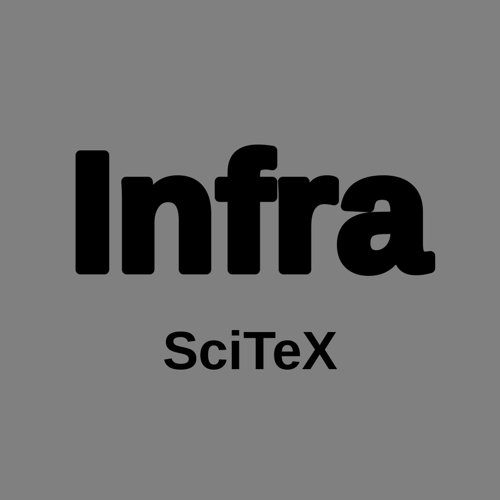
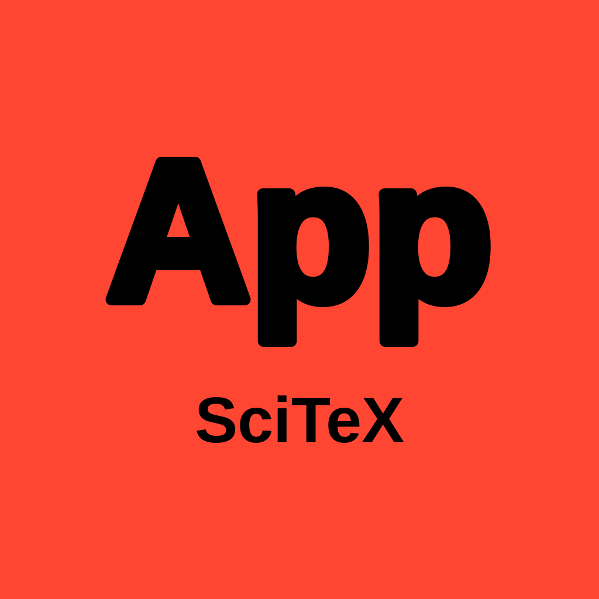

# Domain lead avatars

The four avatars use the existing CCT icon generator and SciTeX wordmark.

| Lead | Label | Figure-theme color | Avatar |
| --- | --- | --- | --- |
| Research | R&D | blue `#0080c0` |  |
| Infrastructure | Infra | gray `#808080` |  |
| Applications | App | red `#ff4632` |  |
| Business | Biz | yellow `#e6a014` |  |

These are the named plotting colors from FigRecipe's
`src/figrecipe/styles/presets/SCITEX.yaml`, not SciTeX website branding colors.
All four labels and wordmarks are black, per the operator's final preference.
The generator fits labels by actual glyph width for small chat-list displays.

Regenerate from the repository root:

```bash
python docs/icons/generate_bot_icons.py \
  --font /usr/share/fonts/truetype/liberation/LiberationSans-Bold.ttf \
  --out docs/icons --only \
  research-lead infrastructure-lead applications-lead business-lead
```

The square images are 1024 × 1024 and keep the lettering inside Telegram's
circular crop. To upload through `setMyProfilePhoto`, convert to JPEG and use
an `InputProfilePhotoStatic` multipart upload. BotFather `/setuserpic` is also
available. See the [Telegram Bot API](https://core.telegram.org/bots/api#setmyprofilephoto).

Only the four leads own Telegram bots. Their domain subagents communicate
through SAC/A2A and Cards rather than sharing the lead's bot token.
